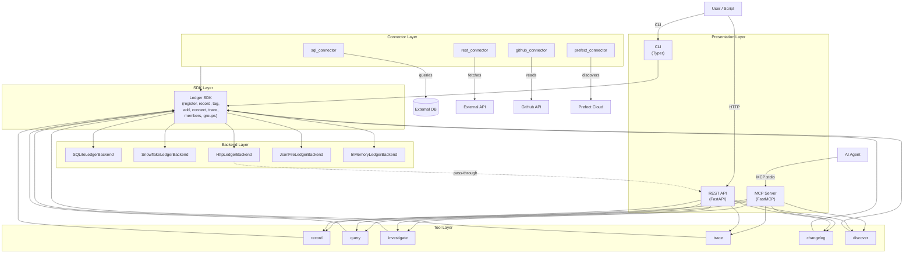
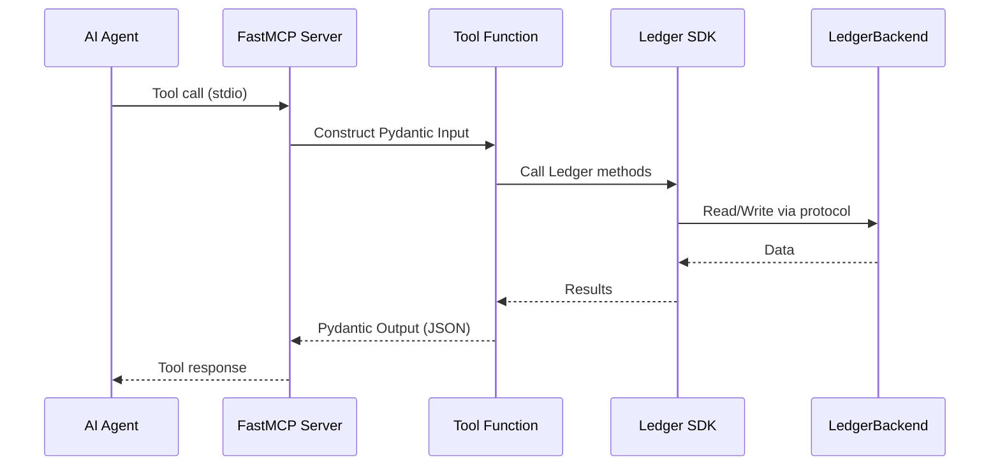
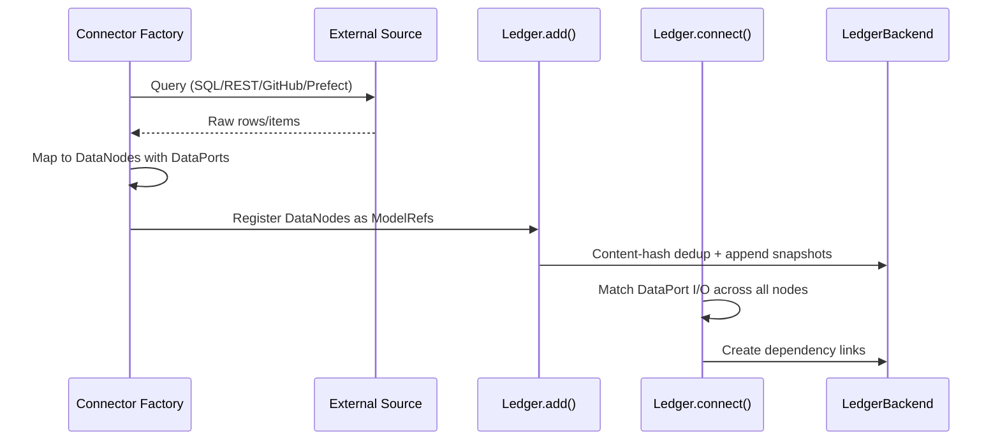
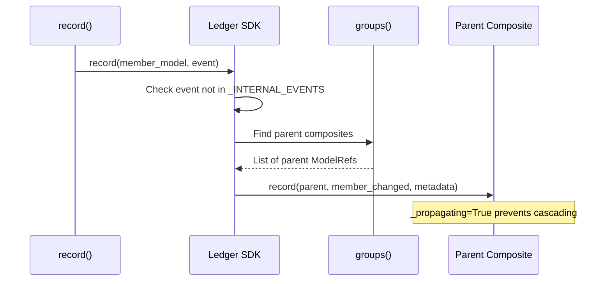

# System Architecture

**Project**: model-ledger
**Architecture Pattern**: Event-Sourced, Protocol-First, Layered with Tool-Shaped API
**Last Updated**: 2026-04-16

## High-Level Architecture

## Component Architecture

### Presentation Layer
**Purpose**: User-facing interfaces — CLI, MCP server for AI agents, REST API for programmatic access
**Components**:
- `src/model_ledger/cli/app.py` — Typer CLI (list, show, validate, audit-log, export, introspect, mcp, serve)
- `src/model_ledger/mcp/server.py` — FastMCP server with 6 tools + 3 resources, stdio transport
- `src/model_ledger/rest/app.py` — FastAPI with 6 endpoints mirroring tools, uvicorn

### Tool Layer
**Purpose**: Six agent-protocol tool functions with Pydantic I/O contracts — the canonical API surface
**Components**:
- `src/model_ledger/tools/schemas.py` — Pydantic I/O models (single source of truth)
- `src/model_ledger/tools/{record,query,investigate,trace,changelog,discover}.py`
**Pattern**: Pure functions with signature `(Input, Ledger) -> Output`, all JSON-serializable

### SDK Layer
**Purpose**: Core business logic — Ledger class orchestrates registration, recording, tagging, dependency linking, membership, and change propagation
**Components**:
- `src/model_ledger/sdk/ledger.py` — Ledger (v0.3.0+ event-log paradigm)
- `src/model_ledger/sdk/inventory.py` — Inventory (v0.2.0 legacy with DraftVersion context manager)

### Backend Layer (Storage)
**Purpose**: Pluggable persistence implementing LedgerBackend protocol
**Components**:
- `SQLiteLedgerBackend` — WAL mode, zero-dep, stdlib sqlite3
- `SnowflakeLedgerBackend` — Production, batched writes with pandas/SQL MERGE fallback
- `HttpLedgerBackend` — REST API pass-through via httpx
- `JsonFileLedgerBackend` — Git-friendly directory tree (models/, snapshots/, tags/)
- `InMemoryLedgerBackend` — Testing and demo

### Connector Layer (Discovery)
**Purpose**: Config-driven factories that discover models from external data sources
**Components**:
- `sql_connector` — SQL query to DataNode mapping with table parsing
- `rest_connector` — REST API pagination and JSON field mapping
- `github_connector` — GitHub Contents API, repo config scanning
- `prefect_connector` — Prefect Cloud deployment discovery

## Data Flow

### Agent Tool Invocation (MCP)

### Model Discovery via Connectors

### Composite Change Propagation

## Integration Points

### External Services
| Service | Purpose | Integration Type |
|---------|---------|-----------------|
| Snowflake | Production storage | Database (MERGE, write_pandas) |
| SQLite | Local persistent storage | Embedded database (stdlib) |
| GitHub API | Discover models from config files | REST API (v3 Contents) |
| Prefect Cloud | Discover orchestration deployments | Python SDK (async) |
| PyPI | Package distribution | CI/CD (GitHub Actions) |
| FastMCP | Expose tools to AI agents | MCP protocol (stdio) |

### MCP-to-REST Pass-Through
The MCP server supports `HttpLedgerBackend` which creates a pass-through mode — all tool calls are forwarded as HTTP requests to a remote REST API deployment.

## Architectural Patterns

| Pattern | Evidence | Description |
|---------|----------|-------------|
| Event Sourcing | ModelRef + Snapshot | All state changes are immutable Snapshots. History replayed for current state. |
| Protocol-First | `@runtime_checkable Protocol` | All extension points use Protocols, not ABCs. Duck typing with type-checker support. |
| Tool-Shaped SDK | 6 tool functions | Every method has clear inputs, JSON-serializable outputs, no side effects beyond the ledger. |
| Factory Pattern | Connector + Backend factories | Config-driven factories return fully-wired instances. |
| Plugin Architecture | Entry points | `importlib.metadata.entry_points()` for introspectors and scanners. |
| Composite Governance | Member tracking via events | Business composites aggregate technical nodes. Membership tracked via snapshots, not FK. |

## Deployment Architecture

**Distribution**: Python package via PyPI (Apache-2.0)
**Build System**: hatchling
**Python**: >=3.10
**Core Dependencies**: pydantic, httpx (minimal)

**Runtime Modes**:
- CLI: `model-ledger <command>`
- MCP server: `model-ledger mcp [--backend sqlite|snowflake|json|http|memory]`
- REST API: `model-ledger serve [--backend ...] [--port 8000]`
- Python SDK: `from model_ledger.sdk.ledger import Ledger`
- Embedded: `Ledger(backend=SQLiteLedgerBackend('db.sqlite'))`

**Optional Dependency Groups**: cli, mcp, rest-api, snowflake, github, excel, introspect-*
