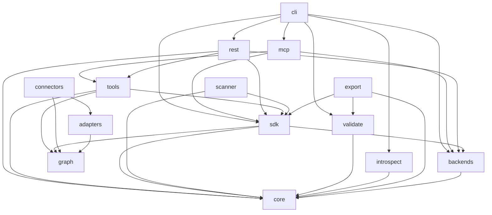

# Module & Component Breakdown

**Project**: model-ledger
**Analysis Date**: 2026-04-16
**Modules Analyzed**: 14

## Core Modules

### core (`src/model_ledger/core/`)
**Purpose**: Domain primitives and type system. Two model generations coexist: v0.3.0 event-log (ledger_models.py) and v0.2.0 entity-based (models.py).
**Key Components**:
- **ModelRef, Snapshot, Tag** (`ledger_models.py`): Event-log domain models with content-addressed hashing
- **Model, ModelVersion, ComponentNode** (`models.py`): Rich regulatory model with IPO structure
- **ModelType, RiskTier, ModelStatus** (`enums.py`): CaseInsensitiveEnum types
- **Observation, ValidationRun, FeedbackEvent** (`observations.py`): Observation lifecycle
- **ModelInventoryError hierarchy** (`exceptions.py`): Actionable exception types
**Dependencies**: pydantic

### sdk (`src/model_ledger/sdk/`)
**Purpose**: Primary user-facing SDK with two API generations.
**Key Components**:
- **Ledger** (`ledger.py`): v0.3.0+ event-log paradigm — register, record, tag, add, connect, trace, members, groups, composite_summary, observations, validations
- **Inventory** (`inventory.py`): v0.2.0 legacy — register_model, new_version, publish, deprecate
- **DraftVersion** (`draft_version.py`): Context manager for version building with auto-save
- **FeedbackCorpus** (`feedback.py`): Query interface over observation feedback history
**Dependencies**: core, backends, graph (for add/connect), introspect/validate (runtime)

### tools (`src/model_ledger/tools/`)
**Purpose**: Six agent protocol tool functions with Pydantic I/O schemas. Each tool is a pure function `(Input, Ledger) -> Output`.
**Key Components**:
- **schemas.py**: Pydantic I/O models — single source of truth for MCP, REST, SDK
- **record.py**: Register or append events
- **query.py**: Search/filter inventory with pagination
- **investigate.py**: Deep-dive with merged metadata, timeline, dependencies, governance
- **trace.py**: Upstream/downstream dependency traversal
- **changelog.py**: Cross-model event timeline
- **discover.py**: Bulk ingestion from inline data, files, or connectors
**Dependencies**: sdk, core, graph

### backends (`src/model_ledger/backends/`)
**Purpose**: Storage layer with protocol-first design. Five LedgerBackend implementations.
**Key Components**:
- **LedgerBackend** (`ledger_protocol.py`): `@runtime_checkable` Protocol for v0.3.0 storage
- **SQLiteLedgerBackend** (`sqlite_ledger.py`): WAL mode, zero-dep, indexes on model_hash/event_type
- **SnowflakeLedgerBackend** (`snowflake.py`): Batched writes, MERGE upserts, write_pandas bulk
- **HttpLedgerBackend** (`http.py`): REST API pass-through via httpx
- **JsonFileLedgerBackend** (`json_files.py`): Git-friendly directory tree
- **InMemoryLedgerBackend** (`ledger_memory.py`): Testing/demo with text search and dedup
- **InventoryBackend** (`protocol.py`): v0.2.0 storage protocol
**Dependencies**: core

### connectors (`src/model_ledger/connectors/`)
**Purpose**: Config-driven source connector factories for automated model discovery.
**Key Components**:
- **sql_connector** (`sql.py`): SQL-based systems with table parsing, model_name discrimination, cron translation
- **rest_connector** (`rest.py`): Paginated REST APIs with dot-path field navigation
- **github_connector** (`github.py`): GitHub Contents API, repo config scanning
- **prefect_connector** (`prefect.py`): Prefect Cloud deployments with tag filtering
**Dependencies**: graph, adapters

### mcp (`src/model_ledger/mcp/`)
**Purpose**: MCP server for AI agent integration. Two modes: direct (any backend) and HTTP pass-through.
**Key Components**:
- **create_server** (`server.py`): Factory creating FastMCP server with 6 tools + 3 resources
**Dependencies**: tools, sdk, backends

### rest (`src/model_ledger/rest/`)
**Purpose**: FastAPI REST API wrapping tool functions as HTTP endpoints.
**Key Components**:
- **create_app** (`app.py`): Factory accepting any LedgerBackend, optional demo data
**Dependencies**: tools, sdk, backends, core

## Support Modules

### graph (`src/model_ledger/graph/`)
**Purpose**: DataNode graph primitives for pipeline topology with schema-based port matching.
**Key Components**:
- **DataNode** (`models.py`): Discoverable entity with typed I/O DataPorts
- **DataPort** (`models.py`): Connection point with wildcard patterns and schema discriminators
- **SourceConnector** (`protocol.py`): `@runtime_checkable` Protocol for discovery plugins

### scanner (`src/model_ledger/scanner/`)
**Purpose**: v0.3.0 scanner framework for platform-level model discovery.
**Key Components**:
- **Scanner, EnrichableScanner** (`protocol.py`): Scan/enrich protocols
- **InventoryScanner** (`orchestrator.py`): Multi-scanner orchestrator with dedup
- **ScannerRegistry** (`registry.py`): Entry-point-based plugin discovery

### adapters (`src/model_ledger/adapters/`)
**Purpose**: Parsing utilities for connectors (SQL, tables, cron).
**Key Components**:
- **sql.py**: extract_tables, write_tables, model_name_filters, lookback, comment tags
- **tables.py**: Pipeline discovery from database tables
- **cron.py**: Cron expression to English translation

### validate (`src/model_ledger/validate/`)
**Purpose**: Profile-based compliance validation engine with three regulatory profiles.
**Key Components**:
- **engine.py**: Registry pattern via @register_profile decorator
- **sr_11_7.py**: Federal Reserve model risk management
- **eu_ai_act.py**: EU AI Act (Annex IV, Articles 9-15)
- **nist_ai_rmf.py**: NIST GOVERN/MAP/MEASURE/MANAGE

### introspect (`src/model_ledger/introspect/`)
**Purpose**: Plugin-based ML model metadata extraction.
**Key Components**:
- **IntrospectorRegistry** (`registry.py`): Entry-point-based lazy discovery
- **SklearnIntrospector** (`sklearn.py`), **XGBoostIntrospector** (`xgboost.py`), **LightGBMIntrospector** (`lightgbm.py`)

### export (`src/model_ledger/export/`)
**Purpose**: Audit pack export (HTML/JSON/Markdown) with compliance artifacts.
**Key Components**: `audit_pack.py`, `templates.py`

### cli (`src/model_ledger/cli/`)
**Purpose**: Typer-based CLI with Rich table output and multi-backend support.
**Key Components**: `app.py` — list, show, validate, audit-log, export, introspect, mcp, serve

## Module Dependencies

## Module Metrics

| Module | Files | Lines | Components | Internal Deps | External Deps |
|--------|-------|-------|------------|---------------|---------------|
| core | 5 | ~520 | 8 | 0 | 1 (pydantic) |
| sdk | 5 | ~1,219 | 4 | 4 | 0 |
| tools | 8 | ~833 | 7 | 3 | 0 |
| backends | 8 | ~1,269 | 7 | 1 | 2 |
| connectors | 5 | ~607 | 4 | 2 | 1 |
| graph | 3 | ~77 | 3 | 0 | 0 |
| scanner | 6 | ~329 | 5 | 2 | 0 |
| adapters | 4 | ~328 | 0 | 1 | 0 |
| mcp | 2 | ~548 | 1 | 3 | 1 (fastmcp) |
| rest | 2 | ~204 | 1 | 4 | 1 (fastapi) |
| validate | 5 | ~585 | 4 | 1 | 0 |
| introspect | 6 | ~287 | 5 | 1 | 0 |
| export | 3 | ~633 | 1 | 2 | 0 |
| cli | 2 | ~469 | 1 | 7 | 2 (typer, rich) |

**Total**: ~7,908 lines across 64 source files

## Cross-Module Patterns

| Pattern | Modules | Description |
|---------|---------|-------------|
| Protocol-First Extension | backends, graph, scanner, introspect | `@runtime_checkable Protocol` for all plugin points. No ABCs. |
| Tool-Shaped SDK | sdk, tools, mcp, rest | Single implementation, three transports. Pydantic schemas as contract. |
| Layered Transport | tools, mcp, rest, cli | Thin wrappers that construct schemas and call tool functions. |
| Content-Addressed Event Log | core, sdk, backends | Immutable Snapshots with content-hash dedup. Append-only audit trail. |
| Entry-Point Plugin Discovery | scanner, introspect | `importlib.metadata.entry_points()` for lazy plugin loading. |
| Connector-Graph-Ledger Pipeline | connectors, graph, sdk, adapters | Discover -> add() -> connect() with idempotent reruns. |
| Dual API Generations | sdk, core, validate, export, tools | v0.2.0 (Inventory) and v0.3.0+ (Ledger) coexist with backward compatibility. |
