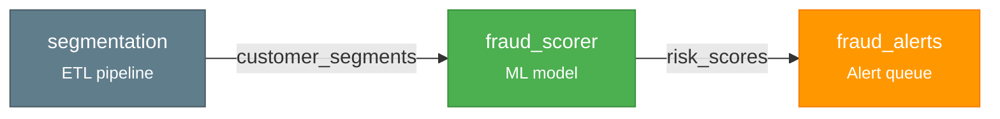
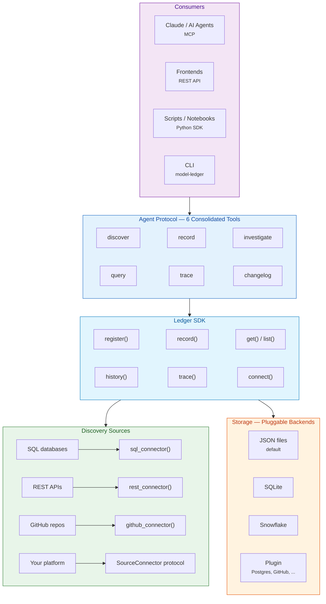

# model-ledger

**Know what models you have deployed, where they run, what they depend on, and what changed.**

[](LICENSE)
[](https://python.org)
[](https://pypi.org/project/model-ledger/)

---

model-ledger is a model inventory for any company with deployed models. It discovers models across your platforms, maps the dependency graph, and tracks every change as an immutable event. Unlike model registries tied to a single platform (MLflow, SageMaker, W&B), model-ledger discovers across *all* of them — as one connected graph.

## Quick Start

**Talk to your inventory** — point Claude (or any MCP-compatible agent) at it:

```bash
pip install model-ledger[mcp]
claude mcp add model-ledger -- model-ledger mcp --demo
```

```
You: "what models are in my inventory?"
Claude: "7 models across 5 platforms. fraud_scoring was retrained
         and deployed this week. Want me to dig into anything?"

You: "if we deprecate customer_features, what breaks?"
Claude: "3 models consume it directly, 2 more transitively."
```

**Or use the Python SDK:**

```python
from model_ledger import Ledger, DataNode

ledger = Ledger.from_sqlite("./inventory.db")

ledger.add([
    DataNode("segmentation",  platform="etl",      outputs=["customer_segments"]),
    DataNode("fraud_scorer",  platform="ml",        inputs=["customer_segments"], outputs=["risk_scores"]),
    DataNode("fraud_alerts",  platform="alerting",  inputs=["risk_scores"]),
])
ledger.connect()

ledger.trace("fraud_alerts")
# ['segmentation', 'fraud_scorer', 'fraud_alerts']
```



## Install

```bash
pip install model-ledger                          # Core — SDK + tools + CLI
pip install model-ledger[mcp]                     # + MCP server (for Claude Code / AI agents)
pip install model-ledger[rest-api]                # + REST API (for frontends / dashboards)
pip install model-ledger[snowflake]               # + Snowflake backend
pip install model-ledger[mcp,rest-api,snowflake]  # Everything
```

## How It Works



Every model is a **DataNode** with typed input and output ports. When an output port name matches an input port name, `connect()` creates the dependency edge automatically. Every mutation is recorded as an immutable **Snapshot** — an append-only event log that gives you full history and point-in-time reconstruction.

## Agent Protocol

Six consolidated tools designed for AI agents ([Anthropic's tool design guidance](https://www.anthropic.com/engineering/writing-tools-for-agents)). Each is a plain Python function with Pydantic I/O — usable via MCP, REST, CLI, or direct import.

| Tool | What it does | Scale |
|------|-------------|-------|
| **discover** | Add models from any source — scan platforms, import files, inline data | Bulk |
| **record** | Register a model or record an event with arbitrary metadata | Single |
| **investigate** | Deep dive — identity, merged metadata, recent events, dependencies | Single |
| **query** | Search and filter the inventory with pagination | Multi |
| **trace** | Dependency graph — upstream, downstream, impact analysis | Graph |
| **changelog** | What changed across the inventory in a time range | Multi |

### Using the tools directly

```python
from model_ledger import Ledger, record, investigate, query
from model_ledger.tools.schemas import RecordInput, InvestigateInput, QueryInput
from model_ledger.graph.models import DataNode

ledger = Ledger.from_sqlite("./inventory.db")

# Register a model
record(RecordInput(
    model_name="fraud_scoring", event="registered",
    owner="risk-team", model_type="ml_model",
    purpose="Real-time fraud detection",
), ledger)

# Record an event with schema-free payload
record(RecordInput(
    model_name="fraud_scoring", event="retrained",
    payload={"accuracy": 0.94, "features_added": ["velocity_24h"]},
    actor="ml-pipeline",
), ledger)

# Deep dive
result = investigate(InvestigateInput(model_name="fraud_scoring"), ledger)
result.metadata      # {"accuracy": 0.94, "features_added": ["velocity_24h"]}
result.total_events  # 2

# Search
models = query(QueryInput(text="fraud", model_type="ml_model"), ledger)
models.total  # 1
```

### MCP server

```bash
model-ledger mcp                                             # empty inventory
model-ledger mcp --demo                                      # sample data
model-ledger mcp --backend sqlite --path ./inventory.db      # SQLite
model-ledger mcp --backend json --path ./my-inventory        # JSON files

# Connect to Claude Code (one time)
claude mcp add model-ledger -- model-ledger mcp
```

### REST API

```bash
model-ledger serve                        # start on port 8000
model-ledger serve --demo --port 3001     # with sample data
```

Auto-generated OpenAPI docs at `/docs`. Endpoints: `POST /record`, `POST /discover`, `GET /query`, `GET /investigate/{name}`, `GET /trace/{name}`, `GET /changelog`, `GET /overview`.

## Discover Models From Your Systems

### SQL databases

```python
from model_ledger import Ledger, sql_connector

ledger = Ledger.from_sqlite("./inventory.db")

# Simple: discover from a registry table
models = sql_connector(
    name="model_registry",
    connection=my_db,
    query="SELECT name, owner, status FROM ml_models WHERE active = true",
    name_column="name",
)

# Advanced: auto-parse SQL to extract table dependencies
etl_jobs = sql_connector(
    name="etl_scheduler",
    connection=my_db,
    query="SELECT job_name, raw_sql, cron FROM scheduled_jobs",
    name_column="job_name",
    sql_column="raw_sql",  # extracts FROM/JOIN as inputs, INSERT/CREATE as outputs
)

ledger.add(models.discover())
ledger.add(etl_jobs.discover())
ledger.connect()  # auto-links ETL outputs to model inputs
```

### REST APIs

```python
from model_ledger import rest_connector

# Works with MLflow, SageMaker, Vertex AI, or any JSON API
ml_models = rest_connector(
    name="mlflow",
    url="https://mlflow.internal/api/2.0/mlflow/registered-models/list",
    headers={"Authorization": "Bearer ..."},
    items_path="registered_models",
    name_field="name",
)
```

### GitHub repos

```python
from model_ledger import github_connector

# Discover pipeline-as-code: Airflow DAGs, dbt projects, scoring pipelines
pipelines = github_connector(
    name="ml_pipelines",
    repos=["myorg/ml-scoring"],
    token="ghp_...",
    project_path="projects",
    config_file="deploy.yaml",
    parser=my_yaml_parser,  # (project_name, file_content) -> DataNode
)
```

### Custom connectors

Implement the `SourceConnector` protocol for anything the factories don't cover:

```python
class SageMakerConnector:
    name = "sagemaker"

    def discover(self) -> list[DataNode]:
        endpoints = boto3.client("sagemaker").list_endpoints()
        return [
            DataNode(ep["EndpointName"], platform="sagemaker",
                     outputs=[ep["EndpointName"]],
                     metadata={"status": ep["EndpointStatus"]})
            for ep in endpoints["Endpoints"]
        ]
```

## Storage

Storage-agnostic. Default is JSON files — human-readable, git-friendly, zero config. Upgrade when you need scale.

```python
from model_ledger import Ledger
from model_ledger.backends.json_files import JsonFileLedgerBackend

ledger = Ledger(JsonFileLedgerBackend("./my-inventory"))              # JSON files — default
ledger = Ledger.from_sqlite("./inventory.db")                         # SQLite — zero infrastructure
ledger = Ledger.from_snowflake(connection, schema="DB.MODEL_LEDGER")  # Snowflake — production
ledger = Ledger()                                                      # In-memory — testing
```

JSON file layout — inspect, diff, and version-control your inventory:

```
my-inventory/
├── models/
│   ├── fraud_scoring.json
│   └── churn_predictor.json
├── snapshots/
│   ├── a1b2c3d4.json
│   └── e5f6g7h8.json
└── tags/
    └── {model_hash}/
        └── v1.json
```

Add community backends via entry points:

```toml
# pyproject.toml
[project.entry-points."model_ledger.backends"]
postgres = "my_package:PostgresBackend"
```

## Additional Capabilities

### Dependency tracing

```python
ledger.trace("fraud_alerts")                              # Full pipeline path
ledger.upstream("fraud_alerts")                           # Everything that feeds this
ledger.downstream("segmentation")                         # Everything that depends on this
```

### Shared table disambiguation

When multiple models write to the same table, `DataPort` schema matching handles precision:

```python
from model_ledger import DataPort, DataNode

DataNode("check_rules", outputs=[DataPort("alerts", model_name="checks")])
DataNode("card_rules",  outputs=[DataPort("alerts", model_name="cards")])
DataNode("check_queue", inputs=[DataPort("alerts", model_name="checks")])
# check_queue connects to check_rules only — model_name must match
```

### Point-in-time inventory

```python
inventory = ledger.inventory_at(datetime(2025, 12, 31))
# Every model that was active on that date
```

### Compliance validation (plugin)

Built-in profiles for SR 11-7, EU AI Act, and NIST AI RMF. Add custom profiles for your organization's policies. See [validation docs](docs/) for details.

### Model introspection

Extract metadata from fitted sklearn, XGBoost, and LightGBM models. Add custom introspectors via the `Introspector` protocol. See [introspection docs](docs/) for details.

## Design Principles

- **Agents are the primary interface** — the MCP server is the product. SDK and CLI are still first-class, but the agent experience is what we optimize for.
- **Fundamental, not specialized** — model inventory for any company with deployed models. Not tied to a specific regulatory framework or industry.
- **Everything is a DataNode** — ML models, heuristic rules, ETL pipelines, alert queues. One abstraction.
- **The graph builds itself** — declare inputs and outputs. Dependencies follow from port matching.
- **Schema-free payloads** — record whatever metadata matters. No schema to maintain, no migrations.
- **Change tracking is central** — every mutation is an immutable Snapshot. The inventory is a living event log.
- **Storage-agnostic** — JSON files, SQLite, Snowflake, or bring your own via the `LedgerBackend` protocol.

## For Organizations

The OSS core handles discovery, graph building, change tracking, storage, and the agent protocol. Your internal package provides:

- **Connector configs** — point factories at your tables and APIs
- **Custom connectors** — for internal platforms the factories don't cover
- **Authentication** — your credentials and auth wrappers
- **Custom backends** — Postgres, GitHub repos, or any storage via `LedgerBackend` protocol
- **Compliance profiles** — SR 11-7, EU AI Act, or your own internal policies (plugin-based)

Your internal repo should be thin config and credentials, not reimplemented logic.

## Contributing

See [CONTRIBUTING.md](CONTRIBUTING.md). All commits require DCO sign-off.

## License

Apache-2.0. See [LICENSE](LICENSE).
