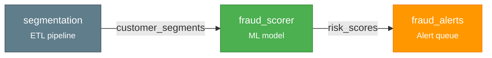
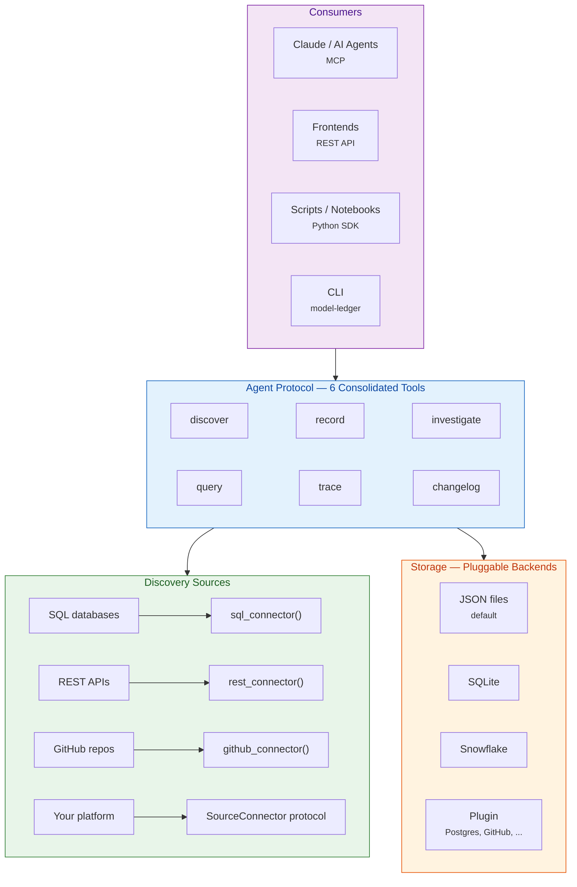

# model-ledger

**Know what models you have deployed, where they run, what they depend on, and what changed.**

[](LICENSE)
[](https://python.org)
[](https://pypi.org/project/model-ledger/)

---

model-ledger is a model inventory for any company with deployed models. It automatically discovers models across your platforms, maps the dependency graph, and tracks every change as an immutable event.

**Agent-first.** Point Claude (or any MCP-compatible agent) at your inventory and talk to it:

```bash
pip install model-ledger[mcp]
model-ledger mcp --demo                                    # start MCP server with sample data
claude mcp add model-ledger -- model-ledger mcp --demo     # connect to Claude Code
```

```
You: "what models are in my inventory?"
Claude: "You have 7 models across 5 platforms. 3 ML models,
         1 heuristic, 3 data pipelines. 5 events in the last week."

You: "what changed recently?"
Claude: "fraud_scoring was retrained and deployed. churn_predictor
         was retrained. credit_risk got updated documentation."

You: "if we deprecate customer_features, what breaks?"
Claude: "3 models consume it directly: fraud_scoring, churn_predictor,
         credit_risk. 2 more depend on those transitively."
```

**Or use the Python SDK directly:**

```python
from model_ledger import Ledger, DataNode

ledger = Ledger.from_sqlite("./inventory.db")

ledger.add([
    DataNode("segmentation",  platform="etl",      outputs=["customer_segments"]),
    DataNode("fraud_scorer",  platform="ml",        inputs=["customer_segments"], outputs=["risk_scores"]),
    DataNode("fraud_alerts",  platform="alerting",  inputs=["risk_scores"]),
])
ledger.connect()

ledger.trace("fraud_alerts")
# ['segmentation', 'fraud_scorer', 'fraud_alerts']
```



Unlike model registries tied to a single platform, model-ledger discovers across *all* of them — ETL pipelines, heuristic rules, scoring jobs, alert queues, and ML models — as one connected graph with a full audit trail.

## Install

```bash
pip install model-ledger                       # Core — SDK + tools + CLI + JSON backend
pip install model-ledger[mcp]                  # + MCP server (for Claude Code / AI agents)
pip install model-ledger[rest-api]             # + REST API (for frontends / dashboards)
pip install model-ledger[snowflake]            # + Snowflake backend
pip install model-ledger[mcp,rest-api,snowflake]  # Everything
```

## How It Works



Every model is a **DataNode** with typed input and output ports. When an output port name matches an input port name, `connect()` creates the dependency edge automatically.

Every mutation is recorded as an immutable **Snapshot** — an append-only event log. Nothing is deleted. This gives you a complete audit trail and point-in-time inventory reconstruction for any date.

## Agent Protocol

Six consolidated tools designed for AI agents ([Anthropic's tool design guidance](https://www.anthropic.com/engineering/writing-tools-for-agents)). Each is a plain Python function with Pydantic I/O — usable via MCP, REST, CLI, or direct import.

| Tool | What it does | Scale |
|------|-------------|-------|
| **discover** | Add models from any source — scan platforms, import files, inline data | Bulk |
| **record** | Register a model or record an event (retrained, deployed, etc.) with arbitrary metadata | Single |
| **investigate** | Deep dive — identity, merged metadata, recent events, dependencies, groups | Single |
| **query** | Search and filter the inventory with pagination | Multi |
| **trace** | Dependency graph traversal — upstream, downstream, impact analysis | Graph |
| **changelog** | What changed across the inventory in a time range | Multi |

```python
from model_ledger import record, investigate, query, RecordInput, InvestigateInput, QueryInput
from model_ledger import Ledger

ledger = Ledger.from_sqlite("./inventory.db")

# Register a model with arbitrary metadata
record(RecordInput(
    model_name="fraud_scoring", event="registered",
    owner="risk-team", model_type="ml_model",
    purpose="Real-time fraud detection",
), ledger)

# Record any event with schema-free payloads
record(RecordInput(
    model_name="fraud_scoring", event="retrained",
    payload={"accuracy": 0.94, "features_added": ["velocity_24h"]},
    actor="ml-pipeline",
), ledger)

# Deep dive on a model
result = investigate(InvestigateInput(model_name="fraud_scoring"), ledger)
result.metadata      # {"accuracy": 0.94, "features_added": ["velocity_24h"]}
result.upstream      # ["feature_pipeline", "transaction_data"]
result.total_events  # 2

# Search the inventory
models = query(QueryInput(text="fraud", model_type="ml_model"), ledger)
models.total  # 1
```

### MCP Server (for Claude Code / AI agents)

```bash
model-ledger mcp                          # start with empty inventory
model-ledger mcp --demo                   # start with sample data
model-ledger mcp --backend sqlite --path ./inventory.db  # use SQLite
model-ledger mcp --backend json --path ./my-inventory    # use JSON files

# Connect to Claude Code (one time)
claude mcp add model-ledger -- model-ledger mcp
```

### REST API (for frontends / dashboards)

```bash
model-ledger serve                        # start on port 8000
model-ledger serve --demo --port 3001     # with sample data
```

OpenAPI docs auto-generated at `/docs`. Endpoints: `POST /record`, `POST /discover`, `GET /query`, `GET /investigate/{name}`, `GET /trace/{name}`, `GET /changelog`, `GET /overview`.

## Discover Models From Your Systems

### SQL databases

Most discovery is "query a table, map rows to models." The `sql_connector` factory handles this without writing classes:

```python
from model_ledger import Ledger, sql_connector

ledger = Ledger.from_sqlite("./inventory.db")

# Simple: discover from a registry table
models = sql_connector(
    name="model_registry",
    connection=my_db,
    query="SELECT name, owner, status FROM ml_models WHERE active = true",
    name_column="name",
)

# Advanced: auto-parse SQL to extract table dependencies
etl_jobs = sql_connector(
    name="etl_scheduler",
    connection=my_db,
    query="SELECT job_name, raw_sql, cron FROM scheduled_jobs",
    name_column="job_name",
    sql_column="raw_sql",  # extracts FROM/JOIN as inputs, INSERT/CREATE as outputs
)

ledger.add(models.discover())
ledger.add(etl_jobs.discover())
ledger.connect()  # auto-links ETL outputs to model inputs
```

### REST APIs

```python
from model_ledger import rest_connector

# Works with MLflow, SageMaker, Vertex AI, or any JSON API
ml_models = rest_connector(
    name="mlflow",
    url="https://mlflow.internal/api/2.0/mlflow/registered-models/list",
    headers={"Authorization": "Bearer ..."},
    items_path="registered_models",
    name_field="name",
)
```

### GitHub repos

```python
from model_ledger import github_connector

# Discover pipeline-as-code: Airflow DAGs, dbt projects, scoring pipelines
pipelines = github_connector(
    name="ml_pipelines",
    repos=["myorg/ml-scoring"],
    token="ghp_...",
    project_path="projects",
    config_file="deploy.yaml",
    parser=my_yaml_parser,  # (project_name, file_content) -> DataNode
)
```

### Custom connectors

For anything the factories don't cover, implement the `SourceConnector` protocol:

```python
class SageMakerConnector:
    name = "sagemaker"

    def discover(self) -> list[DataNode]:
        endpoints = boto3.client("sagemaker").list_endpoints()
        return [
            DataNode(ep["EndpointName"], platform="sagemaker",
                     outputs=[ep["EndpointName"]],
                     metadata={"status": ep["EndpointStatus"]})
            for ep in endpoints["Endpoints"]
        ]
```

## Storage

model-ledger is storage-agnostic. The default is JSON files — human-readable, git-friendly, zero config. Upgrade when you need scale.

```python
from model_ledger import Ledger
from model_ledger.backends.json_files import JsonFileLedgerBackend

ledger = Ledger(JsonFileLedgerBackend("./my-inventory"))              # JSON files — default, git-friendly
ledger = Ledger.from_sqlite("./inventory.db")                         # SQLite — zero infrastructure
ledger = Ledger.from_snowflake(connection, schema="DB.MODEL_LEDGER")  # Snowflake — production scale
ledger = Ledger()                                                      # In-memory — testing
ledger = Ledger(my_custom_backend)                                     # Custom — LedgerBackend protocol
```

JSON file layout — inspect, diff, and version-control your inventory:

```
my-inventory/
├── models/
│   ├── fraud_scoring.json
│   └── churn_predictor.json
├── snapshots/
│   ├── a1b2c3d4.json
│   └── e5f6g7h8.json
└── tags/
    └── {model_hash}/
        └── v1.json
```

Add community backends (Postgres, GitHub, MongoDB) via entry points:

```toml
# pyproject.toml
[project.entry-points."model_ledger.backends"]
postgres = "my_package:PostgresBackend"
```

## Key Capabilities

### Dependency tracing

```python
ledger.trace("fraud_alerts")                              # Full pipeline path
ledger.upstream("fraud_alerts")                           # Everything that feeds this
ledger.downstream("segmentation")                         # Everything that depends on this
ledger.dependencies("fraud_alerts", direction="upstream")  # Detailed with relationship info
```

### Shared table disambiguation

When multiple models write to the same table, `DataPort` handles precision matching:

```python
from model_ledger import DataPort, DataNode

# Two models write to the same alert table with different model_name values
DataNode("check_rules", outputs=[DataPort("alerts", model_name="checks")])
DataNode("card_rules",  outputs=[DataPort("alerts", model_name="cards")])

# This reader only connects to check_rules — model_name must match
DataNode("check_queue", inputs=[DataPort("alerts", model_name="checks")])
```

### Point-in-time inventory

```python
from datetime import datetime
inventory = ledger.inventory_at(datetime(2025, 12, 31))
# Every model that was active on that date
```

### Compliance validation

Built-in profiles for major model risk regulations:

| Profile | Regulation | Checks |
|---------|-----------|--------|
| `sr_11_7` | US Federal Reserve SR 11-7 | Validator independence, governance docs, validation schedule |
| `eu_ai_act` | EU AI Act (2024/1689) | Risk classification, data governance, human oversight |
| `nist_ai_rmf` | NIST AI RMF 1.0 | GOVERN, MAP, MEASURE, MANAGE functions |

### Model introspection

Extract metadata from fitted ML models:

```python
from model_ledger import introspect

result = introspect(fitted_model)
result.algorithm        # "XGBClassifier"
result.features         # [FeatureInfo(name="velocity_30d", ...), ...]
result.hyperparameters  # {"n_estimators": 50, "max_depth": 4}
```

Ships with sklearn, XGBoost, and LightGBM support. Add your own via the `Introspector` protocol.

## Design Principles

- **Agents are the primary interface** — the MCP server is the product. SDK and CLI are still first-class, but the agent experience is what we optimize for.
- **Fundamental, not specialized** — model inventory for any company with deployed models. Not tied to a specific regulatory framework or industry.
- **Everything is a DataNode** — ML models, heuristic rules, ETL pipelines, alert queues. One abstraction.
- **The graph builds itself** — declare inputs and outputs. Dependencies follow from port matching.
- **Schema-free payloads** — record whatever metadata matters: docs, metrics, links, configs. No schema to maintain, no migrations.
- **Change tracking is central** — every mutation is an immutable Snapshot. The inventory isn't a static table — it's a living event log.
- **Storage-agnostic** — JSON files, SQLite, Snowflake, or bring your own backend via the `LedgerBackend` protocol.
- **Thin tools, thick descriptions** — tools return data, agents reason. Domain knowledge lives in tool descriptions, not tool logic.

## For Organizations

model-ledger is designed as a core framework with lightweight organization-specific extensions. The OSS core handles discovery, graph building, change tracking, storage, and the agent protocol. Your internal package provides:

- **Connector configs** — point `sql_connector()` at your tables, `rest_connector()` at your APIs
- **Custom connectors** — for internal platforms the factories don't cover
- **Authentication** — your database/API credentials and auth wrappers
- **Custom backends** — Postgres, GitHub repos, or any storage via `LedgerBackend` protocol
- **Compliance profiles** — SR 11-7, EU AI Act, NIST AI RMF, or your own internal policies (plugin-based)

Your internal repo should be thin config and credentials, not reimplemented logic.

## Contributing

See [CONTRIBUTING.md](CONTRIBUTING.md). All commits require DCO sign-off.

## License

Apache-2.0. See [LICENSE](LICENSE).
