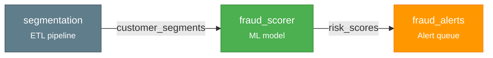
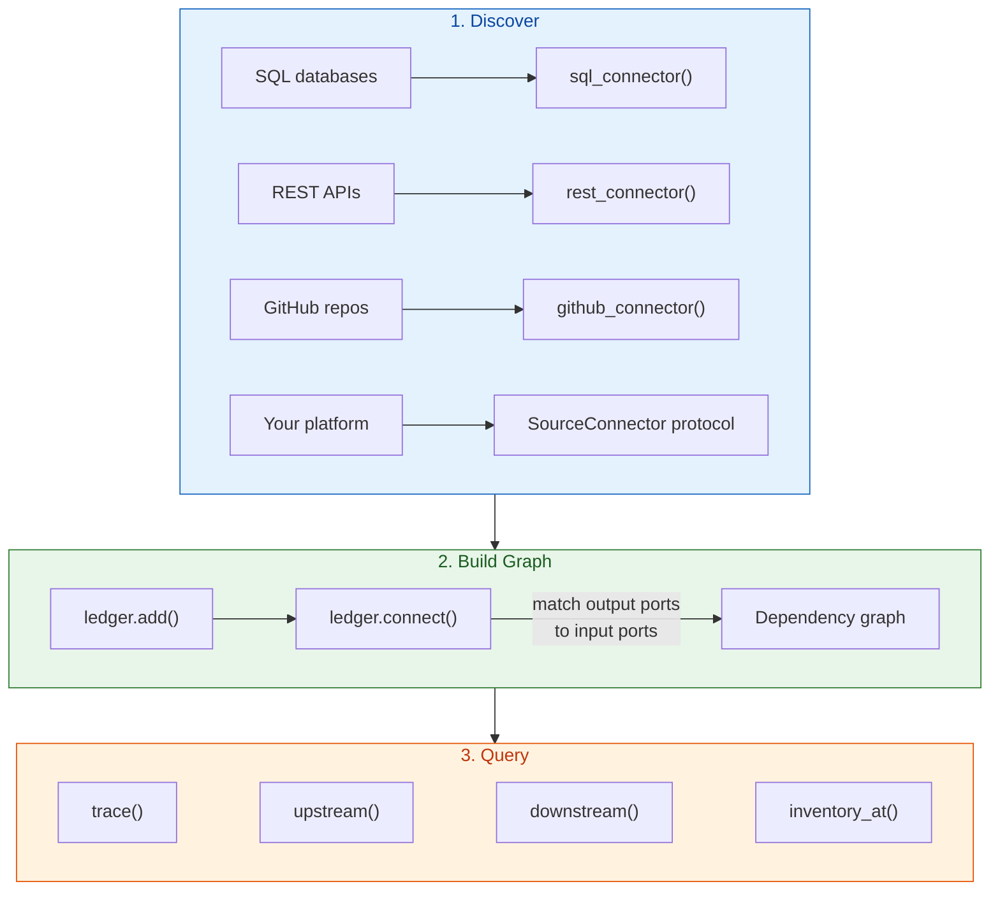

# model-ledger

**The model inventory your regulator actually wants. Auto-discovered, dependency-traced, audit-ready.**

[](LICENSE)
[](https://python.org)

---

model-ledger automatically discovers models, rules, pipelines, and queues across your systems — then builds the dependency graph between them.

```python
from model_ledger import Ledger, DataNode

ledger = Ledger.from_sqlite("./inventory.db")

ledger.add([
    DataNode("segmentation",  platform="etl",      outputs=["customer_segments"]),
    DataNode("fraud_scorer",  platform="ml",        inputs=["customer_segments"], outputs=["risk_scores"]),
    DataNode("fraud_alerts",  platform="alerting",  inputs=["risk_scores"]),
])
ledger.connect()

ledger.trace("fraud_alerts")
# ['segmentation', 'fraud_scorer', 'fraud_alerts']
```



Unlike model registries that track ML models only, model-ledger tracks the *entire model risk ecosystem* — ETL pipelines, heuristic rules, scoring jobs, alert queues, and ML models — as one connected graph with a full audit trail.

## Install

```bash
pip install model-ledger                       # Core + SQLite backend
pip install model-ledger[snowflake]            # + Snowflake backend
pip install model-ledger[rest]                 # + REST API connector
pip install model-ledger[github]              # + GitHub connector
pip install model-ledger[all]                 # Everything
```

## How It Works



Every model is a **DataNode** with typed input and output ports. When an output port name matches an input port name, `connect()` creates the dependency edge automatically.

Every mutation is recorded as an immutable **Snapshot** — an append-only event log. Nothing is deleted. This gives you a complete audit trail and point-in-time inventory reconstruction for any date.

## Discover Models From Your Systems

### SQL databases

Most discovery is "query a table, map rows to models." The `sql_connector` factory handles this without writing classes:

```python
from model_ledger import Ledger, sql_connector

ledger = Ledger.from_sqlite("./inventory.db")

# Simple: discover from a registry table
models = sql_connector(
    name="model_registry",
    connection=my_db,
    query="SELECT name, owner, status FROM ml_models WHERE active = true",
    name_column="name",
)

# Advanced: auto-parse SQL to extract table dependencies
etl_jobs = sql_connector(
    name="etl_scheduler",
    connection=my_db,
    query="SELECT job_name, raw_sql, cron FROM scheduled_jobs",
    name_column="job_name",
    sql_column="raw_sql",  # extracts FROM/JOIN as inputs, INSERT/CREATE as outputs
)

ledger.add(models.discover())
ledger.add(etl_jobs.discover())
ledger.connect()  # auto-links ETL outputs to model inputs
```

### REST APIs

```python
from model_ledger import rest_connector

# Works with MLflow, SageMaker, Vertex AI, or any JSON API
ml_models = rest_connector(
    name="mlflow",
    url="https://mlflow.internal/api/2.0/mlflow/registered-models/list",
    headers={"Authorization": "Bearer ..."},
    items_path="registered_models",
    name_field="name",
)
```

### GitHub repos

```python
from model_ledger import github_connector

# Discover pipeline-as-code: Airflow DAGs, dbt projects, scoring pipelines
pipelines = github_connector(
    name="ml_pipelines",
    repos=["myorg/ml-scoring"],
    token="ghp_...",
    project_path="projects",
    config_file="deploy.yaml",
    parser=my_yaml_parser,  # (project_name, file_content) -> DataNode
)
```

### Custom connectors

For anything the factories don't cover, implement the `SourceConnector` protocol:

```python
class SageMakerConnector:
    name = "sagemaker"

    def discover(self) -> list[DataNode]:
        endpoints = boto3.client("sagemaker").list_endpoints()
        return [
            DataNode(ep["EndpointName"], platform="sagemaker",
                     outputs=[ep["EndpointName"]],
                     metadata={"status": ep["EndpointStatus"]})
            for ep in endpoints["Endpoints"]
        ]
```

## Persistent Storage

```python
from model_ledger import Ledger

ledger = Ledger.from_sqlite("./inventory.db")                        # SQLite — zero infrastructure
ledger = Ledger.from_snowflake(connection, schema="DB.MODEL_LEDGER") # Snowflake — production scale
ledger = Ledger()                                                     # In-memory — testing
ledger = Ledger(my_custom_backend)                                    # Custom — LedgerBackend protocol
```

## Key Capabilities

### Dependency tracing

```python
ledger.trace("fraud_alerts")                              # Full pipeline path
ledger.upstream("fraud_alerts")                           # Everything that feeds this
ledger.downstream("segmentation")                         # Everything that depends on this
ledger.dependencies("fraud_alerts", direction="upstream")  # Detailed with relationship info
```

### Shared table disambiguation

When multiple models write to the same table, `DataPort` handles precision matching:

```python
from model_ledger import DataPort, DataNode

# Two models write to the same alert table with different model_name values
DataNode("check_rules", outputs=[DataPort("alerts", model_name="checks")])
DataNode("card_rules",  outputs=[DataPort("alerts", model_name="cards")])

# This reader only connects to check_rules — model_name must match
DataNode("check_queue", inputs=[DataPort("alerts", model_name="checks")])
```

### Point-in-time inventory

```python
from datetime import datetime
inventory = ledger.inventory_at(datetime(2025, 12, 31))
# Every model that was active on that date
```

### Compliance validation

Built-in profiles for major model risk regulations:

| Profile | Regulation | Checks |
|---------|-----------|--------|
| `sr_11_7` | US Federal Reserve SR 11-7 | Validator independence, governance docs, validation schedule |
| `eu_ai_act` | EU AI Act (2024/1689) | Risk classification, data governance, human oversight |
| `nist_ai_rmf` | NIST AI RMF 1.0 | GOVERN, MAP, MEASURE, MANAGE functions |

### Model introspection

Extract metadata from fitted ML models:

```python
from model_ledger import introspect

result = introspect(fitted_model)
result.algorithm        # "XGBClassifier"
result.features         # [FeatureInfo(name="velocity_30d", ...), ...]
result.hyperparameters  # {"n_estimators": 50, "max_depth": 4}
```

Ships with sklearn, XGBoost, and LightGBM support. Add your own via the `Introspector` protocol.

## Design Principles

- **Everything is a DataNode** — ML models, heuristic rules, ETL pipelines, alert queues. One abstraction.
- **The graph builds itself** — declare inputs and outputs. Dependencies follow from port matching.
- **Schema-agnostic metadata** — `Snapshot.payload` is `dict[str, Any]`. The framework stores whatever your connectors discover.
- **Append-only audit trail** — every change is an immutable Snapshot. Full history, point-in-time queries.
- **Factory for the 80%, protocol for the 20%** — config-driven factories for common patterns, open protocols for anything custom.
- **Batteries included** — persistence, discovery, graph building, and compliance with zero infrastructure.

## For Organizations

model-ledger is designed as a core framework with lightweight organization-specific extensions. The OSS core handles graph building, storage, compliance, and the connector factories. Your internal package provides:

- **Connector configs** — point `sql_connector()` at your tables, `rest_connector()` at your APIs
- **Custom connectors** — for internal platforms the factories don't cover
- **Authentication** — your database/API credentials and auth wrappers
- **Additional compliance profiles** — OSFI E-23, PRA SS1/23, MAS AIRG, or internal policies

Your internal repo should be thin config and credentials, not reimplemented logic.

## Contributing

See [CONTRIBUTING.md](CONTRIBUTING.md). All commits require DCO sign-off.

## License

Apache-2.0. See [LICENSE](LICENSE).
