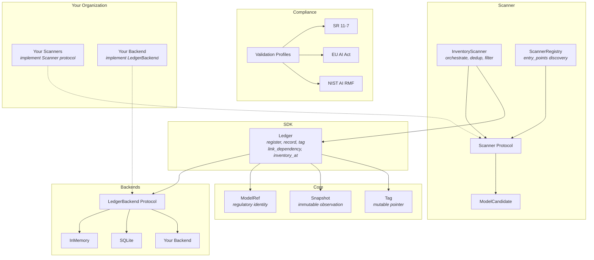
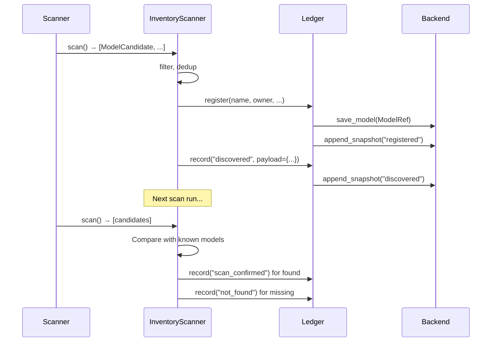

# model-ledger

**Open-source model governance framework. Register, track, and audit every model and rule in your organization.**

[](LICENSE)
[](https://python.org)
[]()

---

## The Problem

Every bank, fintech, and insurer subject to model risk regulation needs a model inventory. Today:

- **56% of financial institutions have NO dedicated MRM technology** (PwC 2022)
- **90% use spreadsheets** for model governance (RMA 2024)
- **No Apache-2.0 tool exists** that treats model governance as code

model-ledger changes this. It's an append-only ledger for every model, rule, and signal in your organization — with point-in-time reconstruction, dependency tracking, and multi-framework compliance validation.

## Quick Start

```bash
pip install model-ledger
```

```python
from model_ledger import Ledger

ledger = Ledger()

# Register a model
model = ledger.register(
    name="fraud-detector",
    owner="ml-team",
    model_type="ml_model",
    tier="high",
    purpose="Real-time fraud detection for payment transactions",
)

# Record observations over time
ledger.record(model, event="deployed", actor="ci-pipeline",
              payload={"environment": "production", "version": "3.1.0"})

ledger.record(model, event="validated", actor="carol",
              payload={"result": "pass", "profile": "sr_11_7"})

# Track dependencies
ledger.register(name="velocity-signal", owner="feature-team",
                model_type="signal", tier="unclassified",
                purpose="30-day transaction velocity")

ledger.link_dependency("velocity-signal", "fraud-detector",
                       relationship="consumes", actor="scanner:ml-platform")

# Query the dependency graph
deps = ledger.dependencies("fraud-detector", direction="upstream")
# [{"model": ModelRef(name="velocity-signal"), "relationship": "consumes", ...}]

# Point-in-time reconstruction
from datetime import datetime, timezone
inventory = ledger.inventory_at(datetime(2026, 3, 15, tzinfo=timezone.utc))
```

## Architecture



## How It Works

model-ledger is an **event log**, not a table. Models are identities. Everything else is timestamped, immutable snapshots.



## Features

### Multi-platform scanning

Discover models across your deployment platforms automatically. The Scanner protocol is the only interface — implement `scan()` and `has_changed()` for any platform.

```python
from model_ledger import Ledger
from model_ledger.scanner import InventoryScanner

ledger = Ledger()
scanner = InventoryScanner(
    ledger,
    scanners=[your_ml_scanner, your_rules_scanner],
    filter_fn=lambda c: c.metadata.get("risk_relevant", True),
)

reports = scanner.discover_all()
for r in reports:
    print(f"{r.platform}: {r.new_models} new, {r.not_found_models} removed")
```

Scanners are discovered automatically via `entry_points` — install a scanner package and it registers itself.

### Dependency tracking

Track model-to-model and model-to-signal dependencies. Features and signals are registered as entities alongside models — the dependency graph grows organically through discovery.

```python
# "Which models break if this signal changes?"
deps = ledger.dependencies("customer-velocity-30d", direction="downstream")

# "What does this model depend on?"
deps = ledger.dependencies("fraud-detector", direction="upstream")
```

### Point-in-time inventory

Reconstruct the exact state of your inventory at any past date. The append-only Snapshot log means nothing is ever lost.

```python
# "What did our inventory look like during the last audit?"
inventory = ledger.inventory_at(audit_date)

# "What was on platform X specifically?"
inventory = ledger.inventory_at(audit_date, platform="ml-platform")
```

### Three compliance profiles

| Profile | Regulation | What It Checks |
|---------|-----------|----------------|
| `sr_11_7` | US Federal Reserve SR 11-7 | Validator independence, I/P/O structure, governance docs, validation schedule |
| `eu_ai_act` | EU AI Act (2024/1689) | Risk assessment, data governance, transparency, human oversight |
| `nist_ai_rmf` | NIST AI RMF 1.0 | GOVERN, MAP, MEASURE, MANAGE functions |

### Model introspection

Plugin-based system that extracts algorithm, hyperparameters, features, and structure from fitted models. Ships with sklearn, XGBoost, and LightGBM. Extensible via entry points.

```python
from model_ledger import introspect

result = introspect(fitted_model)
print(result.algorithm)        # "XGBClassifier"
print(len(result.features))    # 16
print(result.hyperparameters)  # {"n_estimators": 50, "max_depth": 4, ...}
```

### Pluggable storage

Implement the `LedgerBackend` protocol for any database — Postgres, Snowflake, BigQuery, DynamoDB.

```python
ledger = Ledger()                                # InMemory (default)
ledger = Ledger(backend=MySnowflakeBackend())    # Your backend
```

## Install

```bash
pip install model-ledger                          # Core (pydantic only)
pip install model-ledger[cli]                     # + CLI
pip install model-ledger[introspect-sklearn]      # + sklearn introspector
pip install model-ledger[introspect-xgboost]      # + XGBoost introspector
pip install model-ledger[introspect-lightgbm]     # + LightGBM introspector
```

## Design Principles

- **Event log, not a table** — never mutate, always append. Every change is a Snapshot.
- **Protocol-first** — all extension points use `@runtime_checkable` Protocol. No base classes.
- **Agent-friendly** — every SDK method is tool-shaped: clear inputs, JSON-serializable outputs.
- **Schema-free payloads** — new model types, new regulations, new platforms. None require core changes.
- **Plugin discovery** — scanners and introspectors register via `entry_points`. Install a package, it works.

## For Organizations

model-ledger is designed to be extended:

- **Custom scanners** for your ML platforms, rules engines, and model registries
- **Custom backends** for your data warehouse
- **Custom validation profiles** for your regulatory framework (OSFI E-23, PRA SS1/23, MAS AIRG)
- **Dependency tracking** across your model ecosystem

The OSS core handles the data model, SDK, and compliance logic. Your internal package adds the platform-specific scanners and backends.

## Documentation

- [What & Why](docs/what-and-why.md) — Motivation and strategic context
- [Technical Design](docs/technical-design.md) — Data model, SDK, and scanner architecture

## Contributing

See [CONTRIBUTING.md](CONTRIBUTING.md). All commits require DCO sign-off.

## License

Apache-2.0. See [LICENSE](LICENSE).
