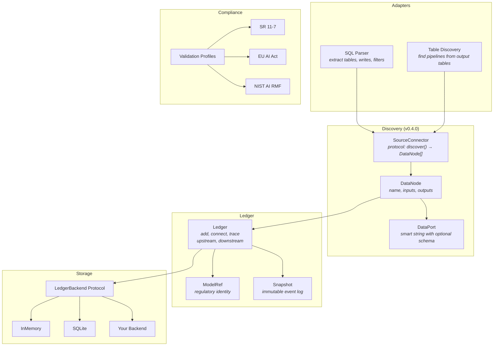
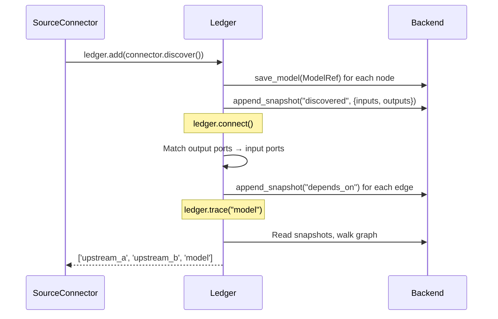

# model-ledger

**Open-source model governance framework for fintechs. Auto-discover models, trace dependencies, validate compliance.**

[](LICENSE)
[](https://python.org)

---

## The Problem

Every financial institution under model risk regulation needs a model inventory. Today, 90% use spreadsheets. model-ledger replaces that with code — auto-discovered models, dependency graphs, and compliance validation from source systems.

## Quick Start

```bash
pip install model-ledger
```

```python
from model_ledger import Ledger, DataNode

ledger = Ledger()

# Define your models with inputs and outputs
segmentation = DataNode("segmentation", outputs=["segments"])
scorer = DataNode("fraud_scorer", inputs=["segments", "velocity"], outputs=["scores"])
alerting = DataNode("fraud_alerts", inputs=["scores"])

# Add and connect — edges build automatically
ledger.add([segmentation, scorer, alerting])
ledger.connect()

# Query the graph
ledger.trace("fraud_alerts")    # → ['segmentation', 'fraud_scorer', 'fraud_alerts']
ledger.upstream("fraud_alerts") # → ['segmentation', 'fraud_scorer']
```

## Architecture



## How It Works

Everything is a **DataNode** with inputs and outputs. The dependency graph builds itself from port matching.



## Key Features

### Auto-discovery from source systems

Write a `SourceConnector` for your platform. It returns `DataNode` objects. The Ledger does the rest.

```python
class MyConnector:
    name = "my_platform"

    def discover(self) -> list[DataNode]:
        # Query your ML platform, rules engine, ETL scheduler, etc.
        return [DataNode("model_a", inputs=["table_x"], outputs=["scores"])]

ledger.add(MyConnector().discover())
ledger.connect()
```

### Shared tables with discriminators

When multiple models write to the same table, use `DataPort` for precision:

```python
from model_ledger import DataPort

# Two models write to the same alert table
DataNode("check_rules", outputs=[DataPort("alerts", model_name="checks")])
DataNode("card_rules", outputs=[DataPort("alerts", model_name="cards")])

# Reader specifies which model's alerts it consumes
DataNode("check_queue", inputs=[DataPort("alerts", model_name="checks")])
# Only connects to check_rules, not card_rules
```

### Table-based pipeline discovery

Discover active pipelines from their output tables — works with any orchestrator:

```python
from model_ledger.adapters.tables import discover_pipelines_from_table

nodes = discover_pipelines_from_table(
    connection=my_db,
    table="scores_archive",
    name_column="model_name",
    timestamp_column="run_date",
)
# Returns one DataNode per active model_name in the table
```

### SQL parsing utilities

Extract table references, write targets, and filters from SQL — useful for any SQL-based connector:

```python
from model_ledger.adapters.sql import extract_tables_from_sql, extract_write_tables

extract_tables_from_sql("SELECT * FROM a.b JOIN c.d ON 1=1")
# → ['a.b', 'c.d']

extract_write_tables("INSERT INTO schema.output SELECT * FROM source")
# → ['schema.output']
```

### Dependency tracking

```python
ledger.trace("fraud_alerts")                              # Full pipeline path
ledger.upstream("fraud_alerts")                           # What feeds this model
ledger.downstream("segmentation")                         # What depends on this
ledger.dependencies("fraud_alerts", direction="upstream")  # Detailed dep info
```

### Point-in-time inventory

```python
# What models existed on a specific date?
inventory = ledger.inventory_at(audit_date)
```

### Compliance validation

| Profile | Regulation | What It Checks |
|---------|-----------|----------------|
| `sr_11_7` | US Federal Reserve SR 11-7 | Validator independence, governance docs, validation schedule |
| `eu_ai_act` | EU AI Act (2024/1689) | Risk assessment, data governance, human oversight |
| `nist_ai_rmf` | NIST AI RMF 1.0 | GOVERN, MAP, MEASURE, MANAGE functions |

### Model introspection

Extract algorithm, features, and hyperparameters from fitted models:

```python
from model_ledger import introspect

result = introspect(fitted_model)
# result.algorithm → "XGBClassifier"
# result.features → [FeatureInfo(name="velocity_30d", ...), ...]
# result.hyperparameters → {"n_estimators": 50, "max_depth": 4}
```

### Pluggable storage

```python
ledger = Ledger()                              # InMemory (default)
ledger = Ledger(backend=MySnowflakeBackend())  # Your warehouse
```

## Install

```bash
pip install model-ledger                       # Core
pip install model-ledger[cli]                  # + CLI
pip install model-ledger[introspect-sklearn]   # + sklearn introspector
```

## Design Principles

- **Everything is a DataNode** — models, rules, pipelines, signals. Same abstraction.
- **The graph builds itself** — connect outputs to inputs. No manual linking.
- **Event log, not a table** — every change is an immutable Snapshot.
- **Protocol-first** — all extension points use `@runtime_checkable` Protocol. No base classes.
- **Data as discovery** — scan database output tables, not orchestration configs. Works with any stack.

## For Organizations

The OSS core handles data models, graph building, and compliance. Your internal package adds:

- **SourceConnectors** for your platforms (Snowflake, SageMaker, Airflow, etc.)
- **LedgerBackend** for your data warehouse
- **Validation profiles** for your regulations (OSFI E-23, PRA SS1/23, MAS AIRG)

## Contributing

See [CONTRIBUTING.md](CONTRIBUTING.md). All commits require DCO sign-off.

## License

Apache-2.0. See [LICENSE](LICENSE).
