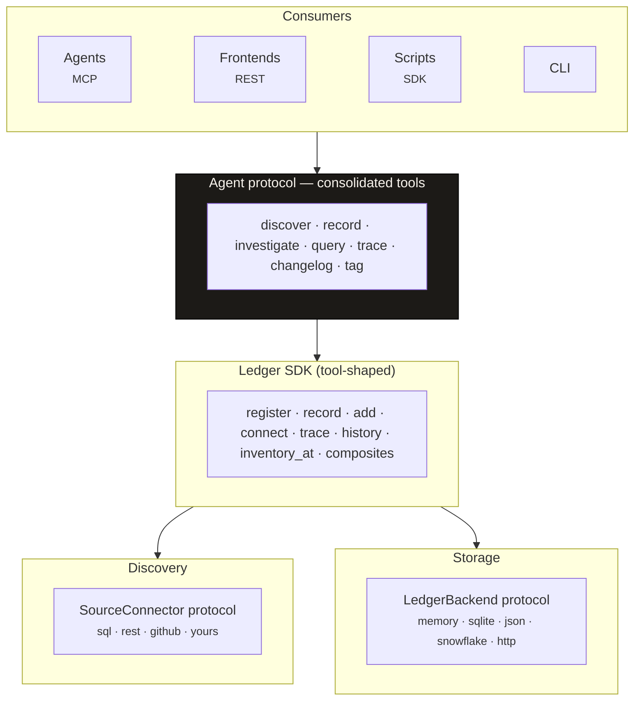

# Architecture

This page is the *why*. For the API, see the [Reference](../reference/index.md); for the
record of specific decisions, the [Design decisions](../adr/index.md).

model-ledger is built on four load-bearing choices. Each was made against a real
alternative, and each carries a cost we accepted on purpose.

## The shape

The consumers are interchangeable because they all bottom out in the same tool-shaped
SDK. Discovery and storage are both *protocols*, so the core stays tiny and the ecosystem
extends it without forking.

## 1. The inventory is an event log, not a registry

A registry stores *current state* and overwrites it. model-ledger stores *what happened*
and never overwrites anything: a model is an identity ([`ModelRef`](snapshot.md)), and
every change is an immutable, content-addressed [`Snapshot`](snapshot.md).

**Why.** The question a governance regime actually asks is *"show me the complete history
of every change, approval, and validation"* — and *"what was true on this past date?"* A
mutable registry structurally cannot answer the second question; an append-only log
answers both for free, and content-addressing makes the chain tamper-evident.

**The cost we accepted.** More storage, and reconstruction (`inventory_at`) is a replay
rather than a row read. We trade write-time simplicity for an audit trail that can't be
quietly edited — the right trade for a system of record. → [ADR 0001](../adr/0001-event-log-not-a-registry.md)

## 2. Everything is a DataNode

An ML model, a heuristic rule, an ETL job, and an alert queue are the same shape: each
consumes some inputs and produces some outputs. So they're one type —
[`DataNode`](datanode.md) with typed ports — and the dependency graph assembles itself
when an output port name matches an input port name.

**Why.** Discovery scales only if connectors stay dumb. A connector emits nodes with
their ports and knows nothing about the rest of the graph; the cross-platform edges
(an ETL job in your warehouse → a model in MLflow → a queue in your alerting system)
fall out of port matching, with no shared ID scheme to maintain.

**The cost we accepted.** Two models can legitimately write a table with the same name.
Bare names would over-link, so `DataPort` carries optional schema discriminators to keep
edges precise. We rejected per-platform model *types* and a fixed metadata schema — both
too rigid to span platforms. → [ADR 0002](../adr/0002-everything-is-a-datanode.md)

## 3. Agents are the primary interface

The SDK is *tool-shaped*: each method maps to one consolidated agent tool, exposed
identically over [MCP](../guides/agents.md) and [REST](../guides/backends.md). The verb
set is deliberately small (`discover`, `record`, `investigate`, `query`, `trace`,
`changelog`, `tag`) rather than a sprawl of endpoints.

**Why.** The most natural way to ask *"which high-risk models changed this week and
haven't been validated?"* is to ask. Designing for the agent first (per
[Anthropic's tool-writing guidance](https://www.anthropic.com/engineering/writing-tools-for-agents))
makes the SDK and REST surfaces cleaner as a side effect — consolidated, orthogonal, hard
to misuse.

**The cost we accepted.** Fewer, broader tools mean a single call does more, which is a
worse fit for fine-grained REST conventions. We optimize for the agent's working memory
over endpoint granularity. → [ADR 0003](../adr/0003-agents-first.md)

## 4. Framework-agnostic core, pluggable everything

Storage, discovery, introspection, and compliance are all `@runtime_checkable` Protocols
discovered via entry points. Regulations live in **profiles** — a plugin layer — not in
the core. The core depends only on `httpx` + `pydantic`.

**Why.** model-ledger is an inventory for *any* organization with deployed models, not a
single-regulation tool. Keeping regulations as a thin, swappable layer means a renumbered
rule (SR 11‑7 → SR 26‑2) is a profile change, not a core change — see
[Governance](../governance.md). The tiny core is also what lets a downstream package add
org-specific connectors and auth without touching it. → [ADR 0004](../adr/0004-framework-agnostic.md) · [ADR 0005](../adr/0005-storage-agnostic.md)

**The cost we accepted.** `record()` takes a schema-free `payload`; envelope validation is
the caller's (or a profile's) responsibility. We trade a rigid schema for the freedom to
record whatever a platform actually has.

## What model-ledger is *not*

Stating the boundary is part of the design:

- **Not a feature store or a serving layer.** It inventories and relates models; it does
  not store features or serve predictions.
- **Not a monitoring/metrics system.** It records *that* a validation or retrain happened
  (as an event); it doesn't compute drift or accuracy.
- **Discovery is point-in-time, not streaming.** Connectors run on a schedule and snapshot
  what they find; `last_seen` lets you detect models that have gone silent, but the graph
  is as fresh as the last sync.
- **Connectors that need live credentials run from the SDK, not the agent.** `rest` and
  `prefect` are pure-config and run through the `discover` tool; `sql`/`github` need a live
  connection or a callable and are driven from the [SDK](../guides/connectors.md). The
  agent gets an actionable error, never a crash.

## Where to go next

- The primitives, in three ideas → [Concepts](index.md)
- The guarantees the event log provides → [Snapshots & the event log](snapshot.md)
- The record of each decision and its alternatives → [Design decisions](../adr/index.md)
