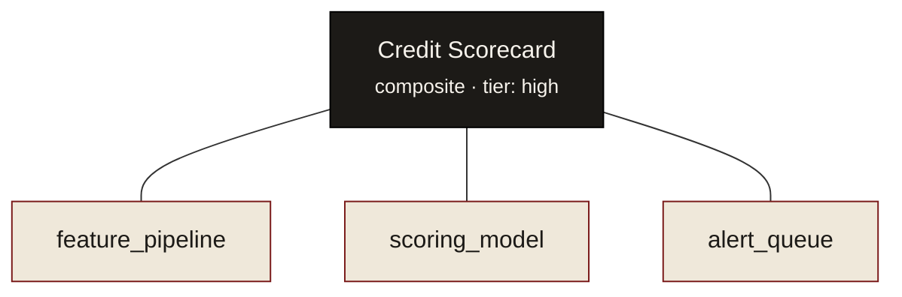

# Composites

A regulator doesn't approve "a SQL job." They approve a **Credit Decision System**.
But that system is really a scorecard, some policy rules, and an ETL pipeline — each
of which deserves its own governance.

A **composite** is the business-level entity that aggregates technical components.
Critically, a member *is itself a model* — so it has its own owner, history, and
validation. Composites are the layer no plain registry or catalog models.

## Register a group and its members

`register_group()` creates the composite and links each member with the
`member_of` relationship:

```python
from model_ledger import Ledger
ledger = Ledger.from_sqlite("./inventory.db")

group = ledger.register_group(
    name="Credit Scorecard",
    owner="risk-team",
    model_type="ml_model",
    tier="high",
    purpose="Credit risk scoring pipeline",
    members=["feature_pipeline", "scoring_model", "alert_queue"],
    actor="system",
)
```



## Membership is an event, too

Add and remove members over time — each change is recorded as a snapshot, so you can
ask *who belonged to this system on any past date*:

```python
ledger.add_member("Credit Scorecard", "challenger_model", role="challenger", actor="risk-team")
ledger.remove_member("Credit Scorecard", "scoring_model", actor="risk-team")

ledger.members("Credit Scorecard")   # current members (replayed from the event log)
ledger.groups("scoring_model")       # which composites a model belongs to

from datetime import datetime
ledger.membership_at("Credit Scorecard", datetime(2025, 12, 31))  # membership as of a date
```

## Roll-up view

`composite_summary()` aggregates a composite and its members into a single governance
view — tiers, statuses, open observations, and validation state across the whole
system:

```python
summary = ledger.composite_summary("Credit Scorecard")
```

This is what makes composites the **primary inventory entry** for governance: an
examiner reads ~one entry per business system, and every technical component beneath it
remains individually traceable.

!!! note "Observations & validations"
    Composites also carry governance events — `record_observation()`,
    `resolve_observation()`, and `record_validation()` — so findings and validation
    outcomes live in the same immutable log as everything else. See the
    [API reference](../reference/index.md).
