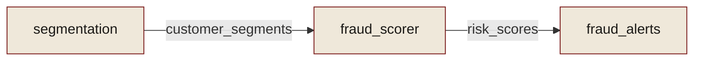

# DataNode & the graph

The core insight: **a model, a rule, an ETL job, and an alert queue are the same
shape.** Each consumes some things and produces others. So they're all one type —
`DataNode` — and the dependency graph falls out of matching what they produce to
what others consume.

## A node is what it reads and writes

```python
from model_ledger import DataNode

DataNode(
    name="fraud_scorer",
    platform="ml",
    inputs=["customer_features"],   # what it consumes
    outputs=["risk_scores"],        # what it produces
    metadata={"framework": "xgboost", "owner": "risk-team"},
)
```

`inputs` and `outputs` are **ports** — the names of the data flowing in and out. A
plain string becomes a [`DataPort`](#dataport-precision) automatically.

## The graph builds itself

You never draw edges. You call `connect()`, and every place an output port name
matches an input port name becomes a dependency:

```python
from model_ledger import Ledger, DataNode

ledger = Ledger()
ledger.add([
    DataNode("segmentation", platform="etl", outputs=["customer_segments"]),
    DataNode("fraud_scorer", platform="ml",  inputs=["customer_segments"], outputs=["risk_scores"]),
    DataNode("fraud_alerts", platform="alerting", inputs=["risk_scores"]),
])
ledger.connect()

ledger.trace("fraud_alerts")     # ['segmentation', 'fraud_scorer', 'fraud_alerts']
ledger.upstream("fraud_alerts")  # everything that feeds it
ledger.downstream("segmentation")# everything that depends on it
```



This is why discovery scales: a connector just emits `DataNode`s with their ports,
and the cross-platform graph assembles itself — an ETL job in your warehouse links to
a model in MLflow links to a queue in your alerting system, with no shared ID scheme.

## DataPort precision

When two models legitimately write a table with the same name, a bare port name would
collide. `DataPort` carries optional schema to disambiguate — edges only form when the
schema matches too:

```python
from model_ledger import DataNode, DataPort

DataNode("check_rules", outputs=[DataPort("alerts", model_name="checks")])
DataNode("card_rules",  outputs=[DataPort("alerts", model_name="cards")])
DataNode("check_queue", inputs=[DataPort("alerts", model_name="checks")])
# check_queue connects to check_rules only — model_name must match.
```

Port matching is case-insensitive, and schema values support `%` wildcards.

## From node to governed model

A `DataNode` gives you structure. To give a node an **identity and history** —
owner, risk tier, purpose, and an audit trail — you
[`register()`](../reference/index.md) it as a [`ModelRef`](snapshot.md) and
[`record()`](snapshot.md) events against it. Discovery and registration are two views
of the same inventory: the graph (what connects to what) and the ledger (what each
thing *is* and how it changed).

[Next: Snapshots & the event log :octicons-arrow-right-24:](snapshot.md)
