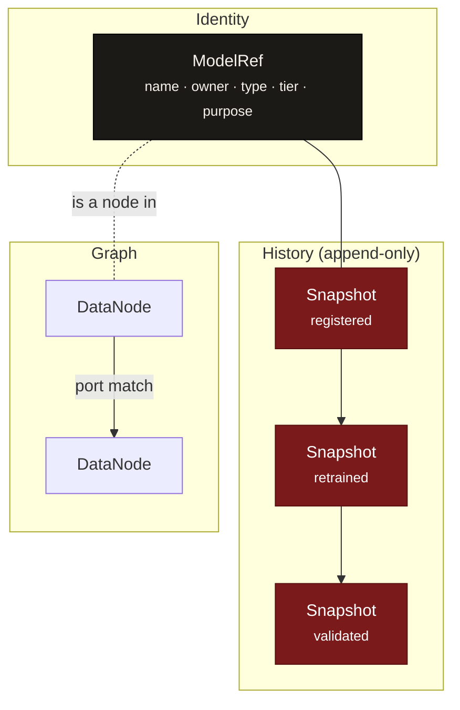

# Concepts

model-ledger is small on purpose. Three ideas carry the whole system.

-   :material-graph-outline:{ .lg } &nbsp;__[DataNode & the graph](datanode.md)__

    ---

    Everything is a `DataNode` with typed input/output ports. Declare what a node
    reads and writes; the dependency graph builds itself from port matching.

-   :material-history:{ .lg } &nbsp;__[Snapshot & the event log](snapshot.md)__

    ---

    A model is an identity (`ModelRef`). Everything that happens to it is an
    immutable, content-addressed `Snapshot`. The inventory is an append-only log.

-   :material-layers-outline:{ .lg } &nbsp;__[Composites](composite.md)__

    ---

    Governed groups whose members are themselves models. A "credit decision system"
    that rolls up its scorecard, policy rules, and ETL — each governed in its own right.

## How they fit together

- **Identity** is the minimum a regulator needs: who owns it, what kind of model,
  how risky, what it's for.
- **History** is every change, immutable and ordered. You can ask the inventory what
  it looked like on any past date.
- **Graph** is how models relate. Declare ports; dependencies follow.

A fourth idea — **compliance profiles** (SR 11-7, EU AI Act, NIST AI RMF) — reads this
data to check completeness. It's a pluggable layer, not part of the core model; see the
[API reference](../reference/index.md).
