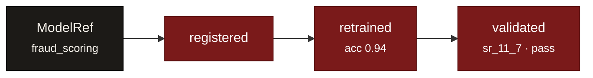

# Snapshots & the event log

Most registries store *current state* and overwrite it. model-ledger stores *what
happened* and never overwrites anything. The inventory is an **append-only event
log** — which is exactly the shape an auditor asks for.

## Identity vs. history

A model splits into two things:

| | What it is | Mutable? |
|---|---|---|
| [`ModelRef`](../reference/index.md) | The regulatory identity: `name`, `owner`, `model_type`, `tier`, `purpose`, `status` | A stable identity (`model_hash`) |
| [`Snapshot`](../reference/index.md) | One immutable observation: an event with a `timestamp`, `actor`, `event_type`, and a free-form `payload` | Never — content-addressed |

```python
from model_ledger import Ledger
ledger = Ledger.from_sqlite("./inventory.db")

ref = ledger.register(
    name="fraud_scoring", owner="risk-team",
    model_type="ml_model", tier="high",
    purpose="Real-time fraud detection",
)
ref.model_hash   # stable identity, derived from name + owner + created_at
```

## Every change is an event

`record()` appends a Snapshot. The `payload` is **schema-free** — record whatever
matters, no migrations:

```python
ledger.record("fraud_scoring", event="retrained", actor="ml-pipeline",
              payload={"accuracy": 0.94, "auc": 0.98, "features_added": ["velocity_24h"]})

ledger.record("fraud_scoring", event="validated", actor="mrm-team",
              payload={"profile": "sr_11_7", "validator": "mrm-team", "result": "pass"})

for s in ledger.history("fraud_scoring"):
    print(s.timestamp, s.event_type, s.payload)
```

Each Snapshot is **content-addressed**: its `snapshot_hash` is derived from the model
hash, the timestamp, and the payload. Identical content can't be silently duplicated,
and the chain is tamper-evident.



## Point-in-time reconstruction

Because nothing is overwritten, you can ask the inventory what it looked like on any
date — the answer an examiner actually wants:

```python
from datetime import datetime, timezone

inventory = ledger.inventory_at(datetime.now(timezone.utc))
# pass any datetime — a past date reconstructs the inventory as it stood then
```

See the recipe: [Point-in-time inventory](../recipes/point-in-time.md).

## Tags: mutable pointers over an immutable log

The log is immutable, but you still want moving labels like `production` or
`latest-validated`. A [`Tag`](../reference/index.md) is a named pointer to a specific
Snapshot; moving it forward is itself recorded.

```python
ledger.tag("fraud_scoring", "production")   # points at the current latest snapshot
```

[Next: Composites :octicons-arrow-right-24:](composite.md)
