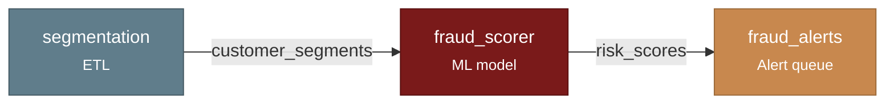

<div class="ml-hero">
  <div class="ml-hero__text">
    <span class="ml-kicker">Open-source model governance</span>
    <h1 class="ml-hero__title">git for models.</h1>
    <p class="ml-hero__tagline">
      Know what models you have deployed, where they run, what they depend on, and
      what changed &mdash; across <em>every</em> platform, as one immutable, queryable graph.
      Built for the regulator&rsquo;s real question: <em>show me everything that ever changed.</em>
    </p>
  </div>
  <div class="ml-hero__art">
    <svg viewBox="0 0 520 300" role="img" aria-label="A dependency graph assembling itself from its nodes">
      <path class="ml-edge" pathLength="1" style="animation-delay:.80s" d="M138,60 L196,60"/>
      <path class="ml-edge" pathLength="1" style="animation-delay:1.00s" d="M256,77 Q260,116 268,151"/>
      <path class="ml-edge" pathLength="1" style="animation-delay:1.10s" d="M138,250 Q196,232 230,185"/>
      <path class="ml-edge" pathLength="1" style="animation-delay:1.30s" d="M328,168 L386,168"/>
      <g class="ml-node" style="animation-delay:0s"><rect x="18" y="43" width="120" height="34" rx="7"/><text x="78" y="60">raw_txns</text></g>
      <g class="ml-node" style="animation-delay:.12s"><rect x="196" y="43" width="120" height="34" rx="7"/><text x="256" y="60">features</text></g>
      <g class="ml-node" style="animation-delay:.24s"><rect x="18" y="233" width="120" height="34" rx="7"/><text x="78" y="250">rules</text></g>
      <g class="ml-node" style="animation-delay:.36s"><rect x="208" y="151" width="120" height="34" rx="7"/><text x="268" y="168">fraud_model</text></g>
      <g class="ml-node" style="animation-delay:.48s"><rect x="386" y="151" width="120" height="34" rx="7"/><text x="446" y="168">review_queue</text></g>
    </svg>
    <p class="ml-hero__caption">declare nodes &middot; <code>connect()</code> &middot; the graph builds itself</p>
  </div>
</div>

`model-ledger` is a model inventory for any organization with deployed models. It
**discovers** models, heuristic rules, and ETL across your platforms, **maps the
dependency graph** automatically, and **records every change as an immutable
event**. Unlike registries tied to one platform (MLflow, SageMaker, W&B), it spans
all of them — and it's built to be driven by AI agents through a native MCP server.

[Get started in 60 seconds :octicons-arrow-right-24:](quickstart.md){ .md-button .md-button--primary }
[Why a ledger, not a registry? :octicons-arrow-right-24:](#why-a-ledger-not-a-registry){ .md-button }

## Four ways in

<div class="grid cards" markdown>

-   :material-language-python:{ .lg .middle } &nbsp;__Python SDK__

    ---

    Declare nodes; the graph connects itself. The whole API is tool-shaped.

    ```bash
    pip install model-ledger
    ```

    [:octicons-arrow-right-24: Quickstart](quickstart.md)

-   :material-robot-outline:{ .lg .middle } &nbsp;__MCP Server__

    ---

    Talk to your inventory. The agent surface is the product — 8 tools, 3 resources.

    ```bash
    pip install "model-ledger[mcp]"
    claude mcp add model-ledger -- model-ledger mcp --demo
    ```

    [:octicons-arrow-right-24: Agent guide](guides/agents.md)

-   :material-api:{ .lg .middle } &nbsp;__REST API__

    ---

    Auto-generated OpenAPI for frontends and dashboards. Same tools over HTTP.

    ```bash
    pip install "model-ledger[rest-api]"
    model-ledger serve --demo
    ```

    [:octicons-arrow-right-24: Backends & serving](guides/backends.md)

-   :material-console:{ .lg .middle } &nbsp;__CLI__

    ---

    Launch the MCP server or REST API from anywhere — zero config to start.

    ```bash
    model-ledger mcp      # for agents
    model-ledger serve    # for HTTP
    ```

    [:octicons-arrow-right-24: Reference](reference/index.md)

</div>

## The graph builds itself

Every model is a [`DataNode`](concepts/datanode.md) with typed input and output ports.
When an output name matches an input name, [`connect()`](reference/index.md) creates the
dependency edge — no hand-wiring.

```python
from model_ledger import Ledger, DataNode

ledger = Ledger.from_sqlite("./inventory.db")

ledger.add([
    DataNode("segmentation", platform="etl",      outputs=["customer_segments"]),
    DataNode("fraud_scorer", platform="ml",       inputs=["customer_segments"], outputs=["risk_scores"]),
    DataNode("fraud_alerts", platform="alerting", inputs=["risk_scores"]),
])
ledger.connect()

ledger.trace("fraud_alerts")
# ['segmentation', 'fraud_scorer', 'fraud_alerts']
```



## One operation, every surface

The SDK, the REST API, and the MCP tools are the **same six verbs** — `discover`,
`record`, `investigate`, `query`, `trace`, `changelog` (plus `tag`/`list_tags`).
Registering a model looks like this everywhere:

=== "Python"

    ```python
    from model_ledger import Ledger
    ledger = Ledger.from_sqlite("./inventory.db")

    ledger.register(
        name="fraud_scoring", owner="risk-team",
        model_type="ml_model", tier="high",
        purpose="Real-time fraud detection",
    )
    ```

=== "MCP (what the agent calls)"

    ```json
    {
      "tool": "record",
      "arguments": {
        "model_name": "fraud_scoring",
        "event": "registered",
        "owner": "risk-team",
        "model_type": "ml_model",
        "purpose": "Real-time fraud detection"
      }
    }
    ```

=== "REST"

    ```bash
    curl -X POST localhost:8000/record \
      -H 'content-type: application/json' \
      -d '{"model_name":"fraud_scoring","event":"registered",
           "owner":"risk-team","model_type":"ml_model",
           "purpose":"Real-time fraud detection"}'
    ```

## Why a ledger, not a registry

A registry answers *"what is the current state?"* A regulator asks *"show me the
**complete history** of every change, approval, and validation."* Those are different
data structures.

model-ledger treats the inventory as an **append-only event log**. A model is an
identity ([`ModelRef`](concepts/snapshot.md)); everything else — every retrain,
every config change, every validation — is an immutable, content-addressed
[`Snapshot`](concepts/snapshot.md). You get full history and point-in-time
reconstruction for free, because nothing is ever overwritten.

<div class="grid" markdown>

:material-graph-outline: &nbsp;**Cross-platform** — ML models, heuristic rules, ETL, and queues are all one `DataNode`. The graph spans MLflow, SageMaker, your warehouse, your scheduler.
{ .card }

:material-history: &nbsp;**Change is the point** — every mutation is an immutable Snapshot. Reconstruct your inventory as it stood on any date.
{ .card }

:material-robot-happy-outline: &nbsp;**Agent-native** — the MCP server is a first-class surface, not an afterthought. Ask Claude *"if we deprecate `customer_features`, what breaks?"*
{ .card }

:material-puzzle-outline: &nbsp;**Bring your own everything** — storage backends, source connectors, and compliance profiles are all pluggable protocols.
{ .card }

</div>

---

Built in the open by [Block](https://opensource.block.xyz/) · Apache-2.0 ·
[Source](https://github.com/block/model-ledger) ·
[PyPI](https://pypi.org/project/model-ledger/) ·
[`/llms.txt`](llms.txt) for agents
