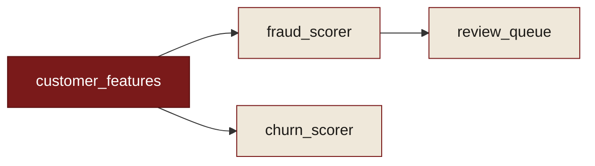

# <span class="recipe-num">Recipe № 1</span> &nbsp; Impact analysis

**Problem.** You want to deprecate `customer_features` (or change its schema). What
breaks?

**Approach.** Models declare their inputs and outputs; `connect()` builds the edges.
`downstream()` then returns everything that depends on a node — directly or
transitively.

```python
from model_ledger import Ledger, DataNode

ledger = Ledger()
ledger.add([
    DataNode("customer_features", platform="feature-store", outputs=["customer_features"]),
    DataNode("fraud_scorer",  platform="ml",       inputs=["customer_features"], outputs=["risk_scores"]),
    DataNode("churn_scorer",  platform="ml",       inputs=["customer_features"], outputs=["churn_scores"]),
    DataNode("review_queue",  platform="alerting",  inputs=["risk_scores"]),
])
ledger.connect()

# Everything that depends on customer_features, directly or transitively:
blast_radius = ledger.downstream("customer_features")
print(blast_radius)
# ['fraud_scorer', 'churn_scorer', 'review_queue']
```

**Expected output.** Three consumers: two models directly (`fraud_scorer`,
`churn_scorer`) and one queue transitively (`review_queue`). Don't deprecate until
those are handled.



## The same question, from an agent

```json
// trace(name="customer_features", direction="downstream")
{ "nodes": [
  {"name": "fraud_scorer", "depth": 1},
  {"name": "churn_scorer", "depth": 1},
  {"name": "review_queue", "depth": 2}
] }
```

> **Claude:** Deprecating `customer_features` breaks 3 things — `fraud_scorer` and
> `churn_scorer` consume it directly, and `review_queue` depends on it one hop further.

## Variations

- `ledger.upstream("review_queue")` — the reverse: everything that feeds a node.
- `ledger.trace("review_queue")` — the full path from roots to a node.
- Use [`DataPort`](../concepts/datanode.md#dataport-precision) when several models write
  a table with the same name, so the blast radius is precise rather than over-broad.
